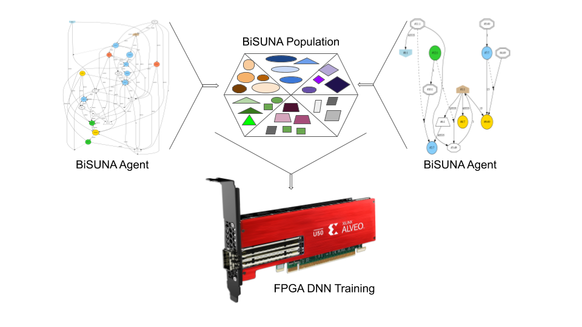
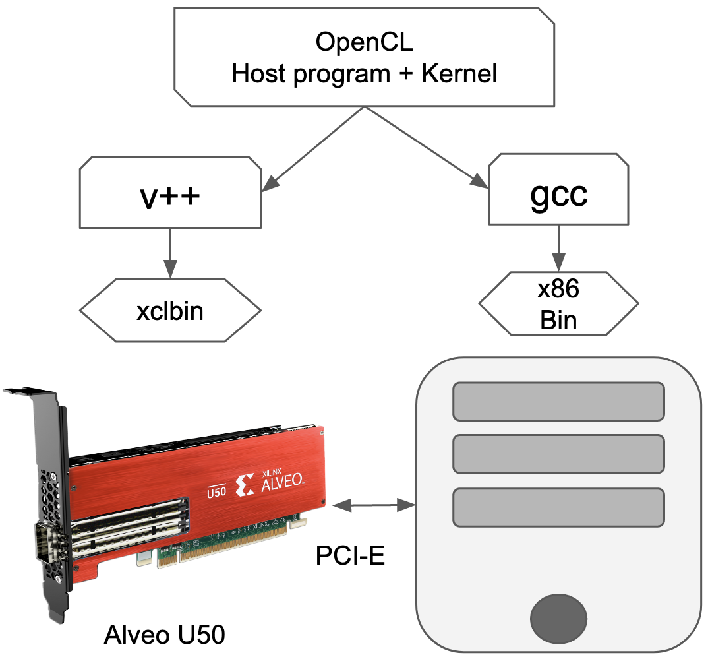
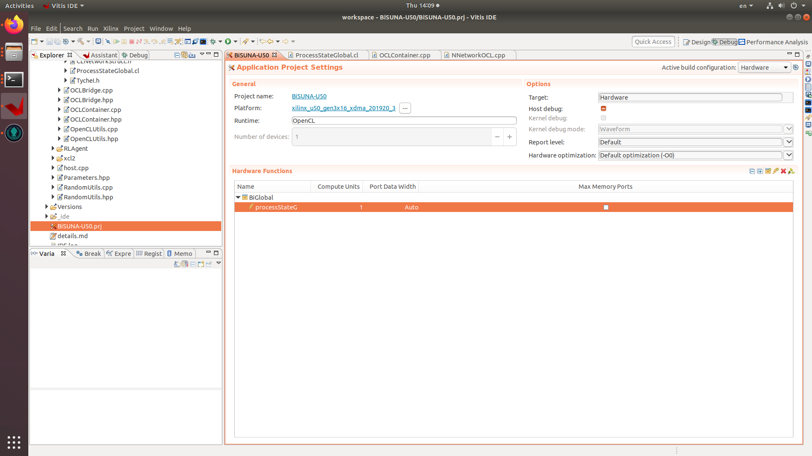
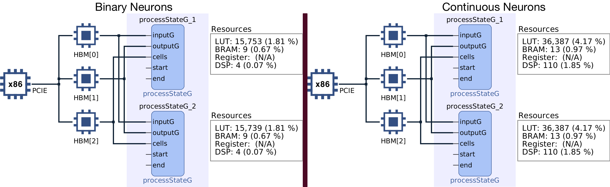
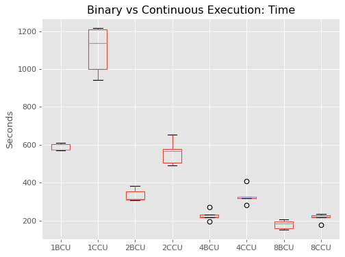

# BiSUNA - Alveo U50

**Bi**nary **S**pectrum-unified **N**euroevolutionary **A** rchitecture capable of executing
neuroevolved agents on the [Alveo U50](https://www.xilinx.com/products/boards-and-kits/alveo/u50.html) FPGA board. This project presents a different approach
to train from scratch Binary Neural Networks (BNN) using neuroevolution as its base technique
(gradient descent free) that takes advantage of the Xilinx Vitis IDE.

Obtain non-linear Deep Neural Networks (DNN) that use binary values in weights, activations,
operations and is completely gradient free; which brings us to the brief summary of the
capabilities of shown with this implementation:

- Weights and activations are represented with fixed length bitset (16 bits currently)
- Only logic operations (AND, XOR, OR...) are used, no need of Arithmetic Logic Unit (ALU)
- Neuroevolution is employed to drive the space search
- BNN do not have a fixed network topology, which adapt and optimize for the problem at hand.



## Installation

This project has been tested with correct execution on Linux and MacOS. It has two main library
requirement in order to be able to compile code from the makefile. The first, it needs the
OpenCL development libraries. If running in a Debian/Ubuntu distribution it is as simple
as running

```
	sudo apt install build-essential opencl-dev
```

The second is the [Xilinx Runtime XRT](https://www.xilinx.com/products/boards-and-kits/alveo/u50.html#gettingStarted), which involves more steps necessary to install
and deploy this project.

The Alveo U50 FPGA is the main target platform, an special compiler is needed to obtain the bitstream
used to deploy on these boards, that is used to reprogram it at time the binary executes. In case a
simple CPU execution is desired, check out the original [project](https://github.com/rval735/bisunaocl) for more details

## Compilation

By simply calling ```make``` will try to compile the full flow of binaries necessary to execute binary and
continuous neurons, along the bitstreams used by the FPGA platform "xilinx_u50_gen3x16_xdma_201920_3"

It would be strongly recommended to just compile sections of it as neccessary:
``` make bisuna BiGlobal-10.xclbin ```
``` make suna CGlobal-10.xclbin ```

The first compiles binary neurons and the FPGA bitstream. The second does the same for continuous neurons.

## Execution

Once a binary is obtained, it is just about to executing the file along with a configuration
file that provides all runtime details like the following:

```
./bisuna resources/FPGAConf.ini  # Run Binary Neurons
./suna resources/FPGAConf.ini # Run Continuous Neurons
```

The ini file will instruct BiSUNA all details of execution, device type and all other configuration.
Have in consideration that FPGAConf.ini has a parameter "EnvironmentConf", which should
have the path to another "ini" file with the correct environment details.

## Reinfocement Learning Environments

- Mountain Car

## FPGA Resource Utilization

Below are shown three screenshots of the resource utilization when BiSUNA was compiled for the Alveo U50:









## This project needs you, provide support

In case you are using this project and would like to contribute to its on-going development cost, please
leave a tip in any of the following addresses:

- Bitcoin: 3J7iV6pRY9vWvymJCULdwV7gWabtAfhKhK
- Ethereum: 0x8E93f5DB847E2a70ba0dA9ca2B7D608D005DEfee
- Bitcoin Cash: qrnsrhhkvathh0vhrj838ywqyzrnvfc2g5f8x3n42k
- Litecoin: MM2WdSGTbqz33cqGEDKxJthGNMh9TYQzdj
- ZCash: t1QQe9Hr2bzCitpfjk9VSnmVLBCzTV62AKL
- Cardano: addr1qy82xnct5f34h7fquqmw8tufp7tdxvc976k8skpw9z68lzss4nxemes0a5s558ts55f5q072z8vgevpyvklcn7ma8v8s375jad
- Tezos: tz1fdL7bFirVBvijUXbnrTo666hQVYkigUC3

If you would like to reference this work, you can use the following bibtex entries, which are also in the [papers](papers/) folder:

@inproceedings{8953134,
	Abstract = {With the explosive interest in the utilization of Neural Networks, several approaches have taken place to make them faster, more accurate or power efficient; one technique used to simplify inference models is the utilization of binary representations for weights, activations, inputs and outputs. This paper presents a novel approach to train from scratch Binary Neural Networks using neuroevolution as its base technique (gradient descent free), to then apply such results to standard Reinforcement Learning environments tested in the OpenAI Gym. The results and code can be found in https://github.com/rval735/BiSUNA.},
	Author = {R. {Valencia} and C. {Sham} and O. {Sinnen}},
	Booktitle = {2019 IEEE Asia Pacific Conference on Circuits and Systems (APCCAS)},
	Date-Added = {2020-01-20 16:32:29 +1300},
	Date-Modified = {2020-01-20 16:32:40 +1300},
	Doi = {10.1109/APCCAS47518.2019.8953134},
	Issn = {null},
	Keywords = {BNN; Neuroevolution;binary neural networks;BiSUNA;discrete optimization},
	Month = {Nov},
	Pages = {301-304},
	Title = {Using Neuroevolved Binary Neural Networks to solve reinforcement learning environments},
	Year = {2019},
	Bdsk-Url-1 = {https://doi.org/10.1109/APCCAS47518.2019.8953134}}

```
```
@inproceedings{8977877,
	Abstract = {The exponential progress of semiconductor tech-nologies has enabled the proliferation of deep learning as a prominent area of research, where neural networks have demon-strated its effectiveness to solve very hard multi dimensional problems. This paper focuses on one in particular, Binary Neural Networks (BNN), which use fixed length bits in its connections and logic functions to perform excitation operations. Exploiting those characteristics, hardware accelerators that integrate field-programmable gate arrays (FPGAs) have been adopted to hasten inference of deep learning networks, given its proficiency to maximize parallelism and energy efficiency. This work will show how the algorithm Binary Spectrum-diverse Unified Neuroevolution Architecture (BiSUNA) can perform training and inference on FPGA without the need of gradient descent. Source code can be found in github.com/rval735/bisunaocl},
	Author = {R. {Valencia} and C. W. {Sham} and O. {Sinnen}},
	Booktitle = {2019 International Conference on Field-Programmable Technology (ICFPT)},
	Date-Added = {2020-02-04 20:40:00 +1300},
	Date-Modified = {2020-02-04 20:40:39 +1300},
	Doi = {10.1109/ICFPT47387.2019.00076},
	Issn = {null},
	Keywords = {BNN, FPGA;BiSUNA;Binary Neural Network;TWEANN;Evolutionary Algorithm},
	Month = {Dec},
	Pages = {395-398},
	Title = {Evolved Binary Neural Networks Through Harnessing FPGA Capabilities},
	Year = {2019},
	Bdsk-Url-1 = {https://doi.org/10.1109/ICFPT47387.2019.00076}}
```
```
@inproceedings{10.1145/3377929.3389933,
	author = {R. {Valencia}, and Sham, Chiu Wing and Vargas, Danilo Vasconcellos},
	title = {Preliminary Study of Applied Binary Neural Networks for Neural Cryptography},
	year = {2020},
	isbn = {9781450371278},
	publisher = {Association for Computing Machinery},
	address = {New York, NY, USA},
	url = {https://doi.org/10.1145/3377929.3389933},
	doi = {10.1145/3377929.3389933},
	booktitle = {Proceedings of the 2020 Genetic and Evolutionary Computation Conference Companion},
	pages = {291–292},
	numpages = {2},
	keywords = {CPA, binary neural network, BiSUNA, adversarial neurocryptography, neuroevolution},
	location = {Canc\'{u}n, Mexico},
	series = {GECCO ’20}
	}
```
